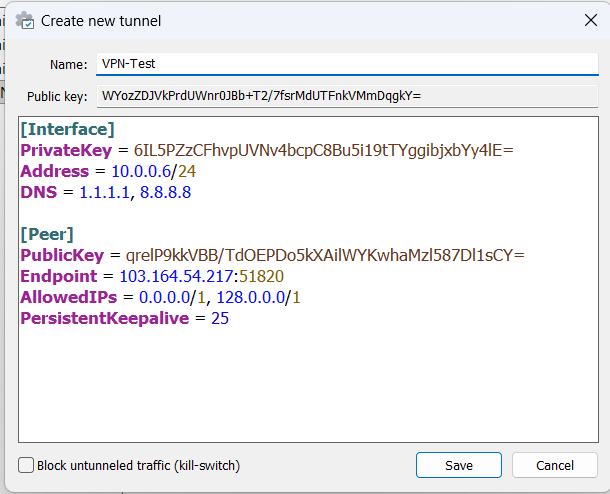

# Tutorial Setting WireGuard VPN

Panduan lengkap untuk mengatur WireGuard VPN di Windows.

## Prasyarat

- Download dan install [WireGuard](https://www.wireguard.com/install/) untuk sistem operasi Anda
- Sudah memiliki konfigurasi VPN dari penyedia layanan

## Langkah-langkah Instalasi

### 1. Buka Aplikasi WireGuard

Jalankan aplikasi WireGuard yang sudah terinstall di komputer Anda.


### 2. Tambah Tunnel Baru

Klik tombol **"Add Tunnel"** di pojok kiri bawah, kemudian pilih **"Add empty tunnel..."** atau tekan `Ctrl+N`.



### 3. Masukkan Konfigurasi VPN

Anda akan melihat jendela "Create new tunnel" dengan editor konfigurasi.

#### Paste konfigurasi berikut:

```ini
[Interface]
PrivateKey = xxxxxxxxxxxxxxxxxxxxxx
Address = xxxxxxxxxxx
DNS = 1.1.1.1, 8.8.8.8

[Peer]
PublicKey = xxxxxxxxxxxxxxxxxxxx
Endpoint = xxxxxxxxxxxxxxx
AllowedIPs = xxxxxxxx
PersistentKeepalive = 25
```

> **Catatan:** Ganti konfigurasi di atas dengan konfigurasi yang diberikan oleh penyedia VPN Anda.

### 4. Beri Nama Tunnel

Di bagian **"Name:"**, masukkan nama untuk tunnel VPN Anda.

**Penting:** 
- Nama tidak boleh mengandung spasi
- Contoh nama yang benar: `VPN-Test`, `MyVPN`, `Office-VPN`

### 5. Simpan Konfigurasi

Klik tombol **"Save"** untuk menyimpan konfigurasi tunnel.

### 6. Aktifkan VPN

Setelah tunnel tersimpan, pilih tunnel yang baru dibuat dari daftar di sebelah kiri, kemudian klik tombol **"Activate"** untuk mengaktifkan koneksi VPN.

Status akan berubah menjadi **"Active"** jika koneksi berhasil.

## Penjelasan Konfigurasi

## Troubleshooting
- Contact : support@idnstudiodigital.com

## Lisensi

Tutorial ini bebas digunakan untuk keperluan apapun.

---

**Dibuat dengan ❤️ untuk komunitas**
